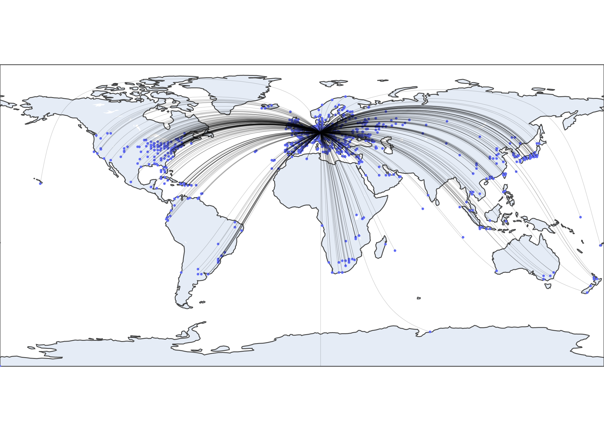
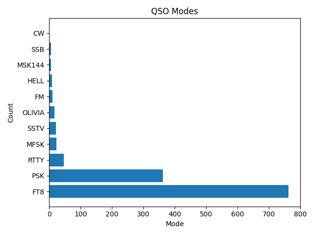
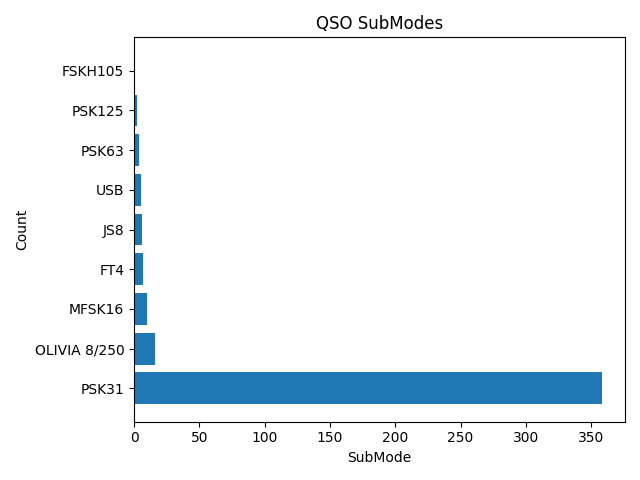
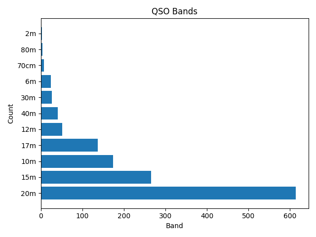
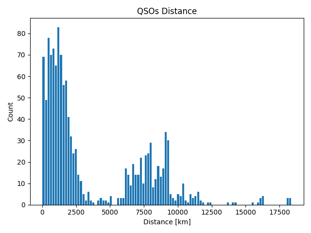
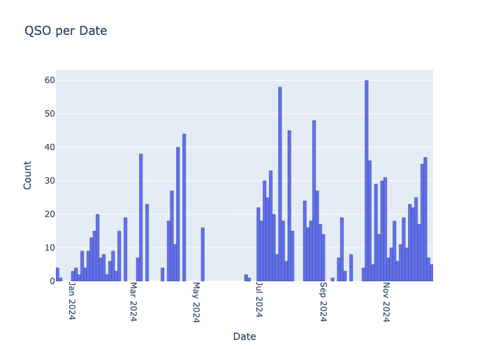
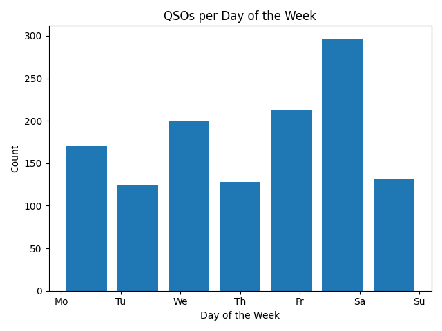
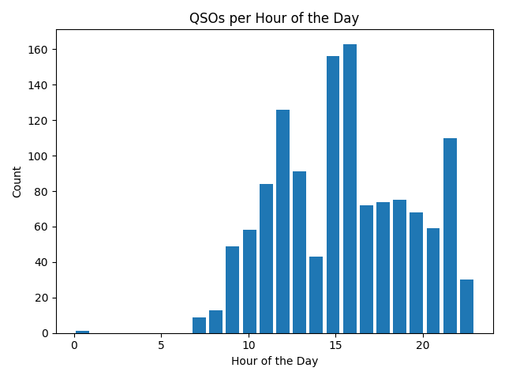

# ADIF-Log-Analyzer

Author: [DD7MB](https://dd7mb.de)

A python tool for analysing and visualising ADIF (Amateur Data Interchange Format) logbook files.

See example output below.

## Let's get started

### Installation

- Clone this repository and `cd` into it
- Create virtual python env `python -m venv algEnv`
- Activate env `source algEnv/bin/activate`
- Install dependencies `pip install -r requirements.txt`

### Usage

- Add your `*.adif` files to the `workData/input` folder
- Run the script `python main.py` (activate your virtual env before, see installation)
- See output in `workData/output` folder

## Example Output

### Stats

```
Total QSOs: 1345
First QSO: 2023-12-18 17:30:00
Last QSO: 2024-12-14 12:24:36
Num Calc Dist: 1342 (99.78%)
Num QSL Sent: 913 (67.88%)
Num Locators: 905
My Locator: JN59NK
My Call: DF0OHM
```

### Pngs









