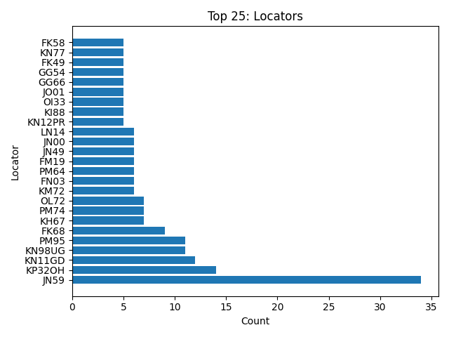

# ADIF-Log-Analyzer

Author: [DD7MB](https://dd7mb.de)

A python tool for analysing and visualising ADIF (Amateur Data Interchange Format) logbook files.

See example output below.

## Live Demo

See also [Live Demo](https://dd7mb.de/df0ohm-2024.html)

## Let's get started

### Installation

- Clone this repository and `cd` into it
- Create virtual python env `python -m venv algEnv`
- Activate env `source algEnv/bin/activate`
- Install dependencies `pip install -r requirements.txt` or `pip install -r requirements-alt.txt`

Debug: With some operating systems, `python3` and `pip3` must be used instead of `python` and `pip`!

### Usage

- Add your `*.adif` files to the `workData/input` folder
- Run the script `python main.py` (activate your virtual env before, see installation)
- See output in `workData/output` folder

## Example Output

### Plots


### FT8 Plots


### Top Lists





### Files

- `workData/output/qso_map.html`
- `workData/output/ov_logbook.txt`
- `workData/output/ov_germany.txt`

### Stats

```
Total QSO: 1400
First QSO: 2023-12-18 17:30:00
Last QSO: 2024-12-20 08:41:14
Num Paper QSL Sent: 913 (65.21%)
Num Locators: 936
My Locator: JN59NK
My Call: DF0OHM
```

```
# Club Stations Germany 

2024-03-09 12:51:45 - DF0TV: Club Station Erlangen, B08
2024-10-30 09:57:30 - DL0DM: Deutsches Museum
2024-10-30 13:28:30 - DK0BMW: Clubstation BMW Werk Regensburg
2024-11-05 18:24:48 - DL0EPC: Karl
2024-11-28 13:10:44 - DK0PT: University Club Station OTH Regensburg
2024-12-01 12:13:04 - DF0GIF: Sigi DJ8VJ
2024-12-14 17:18:44 - DL0MLU: Martin-Luther-University

# Special Stations Germany 

2024-07-17 20:56:23 - DL50WAF: Club Station from DL0AH
```